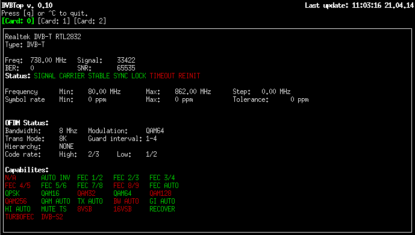

# DVBTop v0.1
*The DVB frontend top.*

NCurses powered terminal application for monitoring status of DVB cards in Linux.

##Screenshot

##Requirements
* Linux DVB API >= 5
* NCurses

##Install
$ make && sudo make install

##Usage
Press "Q" to quit.
Press 1-9 to switch between cards